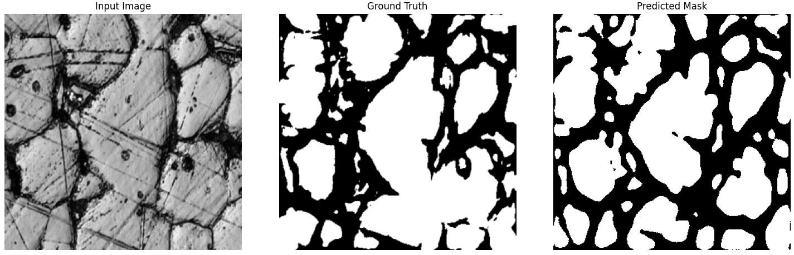

# Compare Grain Segmentation with different Architectures

This project implements and compares three deep learning models—U-Net, ResNet, and Vision Transformer (ViT)—for segmenting grain boundaries in stainless steel microstructure images. The dataset used is the [ExONE Stainless Steel 316L Grains 500X](https://www.kaggle.com/datasets/peterwarren/exone-stainless-steel-316l-grains-500x) from Kaggle, containing grayscale images (`Grains`) and their corresponding segmentation masks (`Segmented`).

## Project Overview

The goal is to train and evaluate neural networks to accurately segment grain boundaries and estimate grain sizes in stainless steel images. The models are implemented in PyTorch, trained on a paired dataset, and evaluated using multiple metrics.

### Models
1. **U-Net**: A convolutional neural network with an encoder-decoder structure and skip connections, optimized for biomedical image segmentation.
2. **ResNet**: A residual network adapted for segmentation with skip connections, dropout regularization, and a custom decoder.
3. **Vision Transformer (ViT)**: A transformer-based model using patch embeddings and self-attention, adapted for pixel-level segmentation.

## Setup

### Prerequisites
- Python 3.8+
- PyTorch 1.8+ with CUDA support (for GPU acceleration)
- Kaggle account and API token (to download the dataset)

### Installation
1. Clone the repository:
   ```bash
   git clone https://github.com/adiManethia/DeepGrain
   cd DeepGrain
   ```
2. Install dependencies:
    ```bash
    pip install -r requirements.txt
    ```
3. Download the dataset:
   Add the dataset via Kaggle notebook or download manually to /kaggle/input/exone-stainless-steel-316l-grains-500x.

### Running the code
* Open the script in a Python environment (e.g., Jupyter Notebook, Kaggle Notebook.
* Ensure CUDA is available if using GPU.
* Run the script- script will load, preprocesss the dataset, train all three models for 25 epochs and evaluate and visualize results.

### Evaluation Metrics
1. **Test Loss ( BCEWithLogitsLoss)**:
   Binary cross-entropy with logits loss measures the per-pixel difference between predicted logits and true binary masks.
   ```bash
   Loss = -1/N * Σ [y_i * log(σ(x_i)) + (1-y_i) * log(1-σ(x_i))]
   ```
   Lower value indicates better pixel-level accuracy.
2. **Dice score**:
    Measures the overlap between predicted and true segmentation masks, emphasizing segmentation quality.
   ```bash
   Dice = (2 * |P ∩ T| + ε) / (|P| + |T| + ε)
   ```
   Higher value indicate better overlap
3. **Grain Size Difference**:
   Compares the average predicted grain size to the true grain size, calculated via line intercept method.
   For our case:
   * Positive: Predicted grains are larger (fewer edges, e.g., U-Net: 5.74).
   * Negative: Predicted grains are smaller (more edges, e.g., ResNet: -4.98).
   * Closer to 0 indicates better grain size estimation.
  
### Results
   ```bash
   Final Model Comparison:
   Model      Dice Score   Grain Size Diff   Test Loss
   -----------------------------------------------
   U-Net      0.8916       5.74             0.3069    
   ResNet     0.8758       -4.98            0.7256    
   ViT        0.8695       -0.48            0.3524  
  ```
* U-Net: Best performer (lowest loss, highest Dice), slightly overestimates grain size.
* ResNet: Improved with skip connections; high loss suggests noisy predictions.
* ViT: Balanced performance, minor underestimation of grain size.
  


### Future work
* Tune ResNet’s dropout or learning rate for lower test loss.
* Experiment with ViT’s patch size (e.g., 8) for finer granularity.
* Apply post-processing (e.g., morphological operations) to smooth predictions.
* Use a separate validation set for early stopping.
